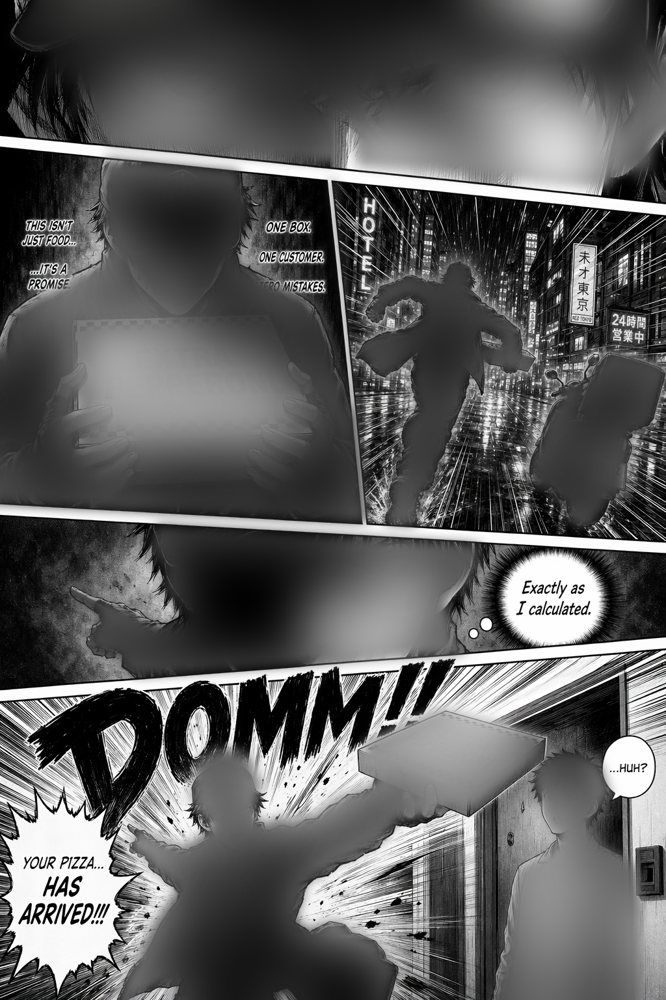
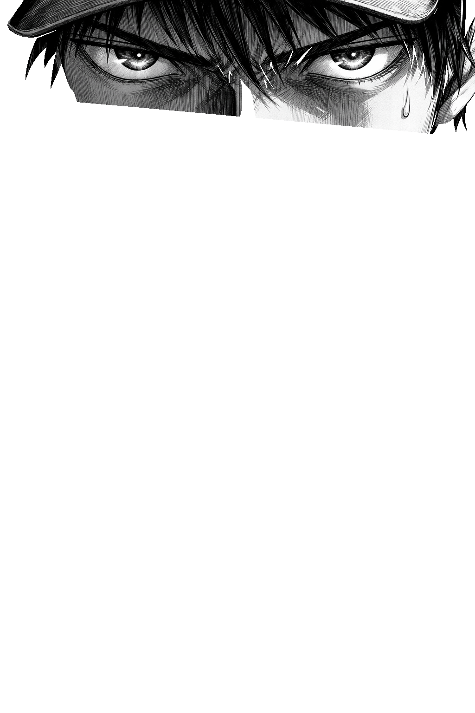
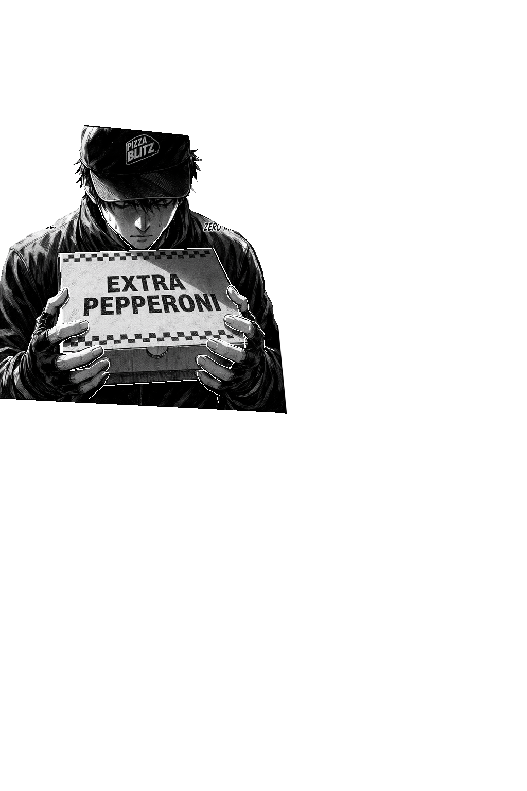
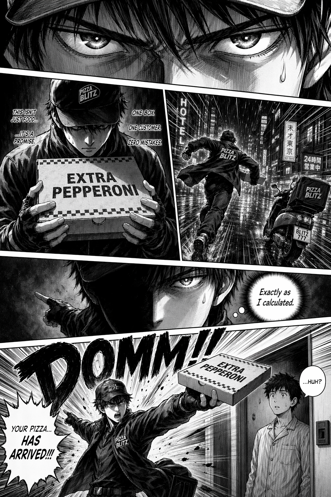

# Motion Manga Skill

A prescriptive guide for turning a manga page **the user has already
provided** into a vertical-format animated motion comic with voice, SFX,
and pixel-accurate panel masking. Written for an AI agent operating
inside (or alongside) the `manga-motion` factory repo.

**Read this doc linearly.** Each stage depends on the previous. Footguns
are noted inline at the point they bite.

---

## Starting state

The user has come to you with one or more manga page images (PNG, ideally
1024×1536 or close, B&W or color). Your job is to turn them into a
~14–16 s vertical motion comic at 1080×1920.

You produce nothing about the page art itself. Generation, scanning,
re-drawing, panel rearrangement — all out of scope. If the page looks
wrong, ask the user to fix the page; don't try to fix it downstream.

A note on numbering: Stages below start at **Stage 2** because Stage 1
(page generation) is owned by the user. The numbering is kept aligned
with `PIPELINE.md` so cross-references match.

---

## What this skill does

Input:
- 1+ manga page PNGs (provided by user)
- A short script: per-panel dialogue, narration, and SFX cues
- A character → voice-ID map (which ElevenLabs voice plays whom)

Output: an MP4 at 1080×1920, ~14–16 s, with:
- Pixel-accurate panel masks for "dark until read" reveal
- Motion-comic camera movement (pan + push-in per panel)
- Voiceover per speaking line, SFX per beat
- Optional per-character motion (Stage 2.5)
- **TikTok-native pacing** (see §"Pacing rules")

**Target platform: TikTok / Reels / Shorts.** Vertical 9:16, 14–16 s
total, cold-open hook in the first second, no dead air. Pacing decisions
throughout this doc assume this target. If you're producing for a
different platform (YouTube landscape, standalone film, etc.) the rules
loosen — see §4.8.

Per page cost: ~$0.40 in API fees (mask gen + TTS + SFX).
Per page compute: ~2 min of local CPU (browser render + CV).

## Working layout

You will be operating in (or copying from) this factory repo. The pieces
relevant to you:

```
manga-motion/
├── SKILL.md           # this file
├── PIPELINE.md        # detailed reference for each stage
├── tools/             # Python scripts: panel masks, fg cutouts, voice
├── template/          # Hyperframes project boilerplate
└── examples/
    └── pizza-blitz/   # complete worked example — open it if stuck
```

For a new project, copy `template/` to a fresh directory, drop the user's
page(s) in, then walk through Stages 2–4 below. The example under
`examples/pizza-blitz/` is the canonical "this is what done looks like."

## Prerequisites

- `~/Documents/openai_api_key.txt` — OpenAI key for GPT Image 2 (used
  only for **mask generation**, not page generation)
- `~/Documents/elevenlabs_api_key.txt` — ElevenLabs key for TTS + SFX
- Existing voice IDs for the cast (keep a persistent character →
  voice-ID map; the example's map is in `examples/pizza-blitz/`)
- Node.js + npx + ffmpeg on PATH
- Python 3 with: `openai`, `opencv-python`, `shapely`, `numpy`, `pillow`,
  `requests`

---

## Stage 2: Segment the page into panels

Two-step pipeline: LLM for topology, classical CV for geometry. The image
model *knows* what a panel is but is imprecise about coordinates. Classical
CV is precise but fails on ambiguous gutters. Combined, they work.

### 2a. Generate a binary panel-fills mask

Call `tools/gen_panel_mask_v2.py`:

```bash
python3 tools/gen_panel_mask_v2.py page1.png page1_mask.png
```

This sends page1.png to GPT Image 2 (`images.edit`) with this exact prompt:

```
Output a BINARY DIAGRAM the same size as the input image.

Task: fill EVERY comic panel's interior with PURE WHITE (#FFFFFF), and
fill ONLY the gutters between panels with PURE BLACK (#000000).

Count every panel, including:
- Panels that bleed to the edge of the page (fill them white all the way
  to the page boundary).
- Dark-toned panels (night scenes, black backgrounds) — they are still
  panels; fill them solid white in the output.
- Small panels, reaction panels, splash panels — all panels.

Output constraints:
- Strictly two colors. No grayscale. No manga artwork. No characters.
- **Do NOT draw a black frame/border around the page.** If a panel bleeds
  to a page edge, its white fill must extend to the very edge.
- Same resolution as the input.
```

### Footguns

- **Missing dark panels.**  Without the "dark-toned panels are still panels"
  clause, the model may miss a night-scene panel that bleeds to edges. If
  this happens, regen with that clause emphasized.
- **Drawing a page frame.**  Without the "do NOT draw a black frame" clause,
  the mask comes back with a black rectangle around the page, shrinking
  bleed panels by ~20 px on every side.
- **Wrong panel count.**  The mask generator occasionally splits one panel
  into two via a spurious diagonal, or merges two into one. Inspect the
  mask visually before proceeding. Re-generate if count is off.
- **Anti-aliasing at edges.**  Output is ~90% pure binary, ~10%
  anti-aliased edge pixels. Threshold during extraction (Otsu or hard
  threshold at 127). Don't trust the raw mask without threshold.

### 2b. Snap the rough mask to real gutters

Call `tools/snap_mask.py`:

```bash
python3 tools/snap_mask.py page1.png page1_mask.png
# outputs page1_snapped_panels.json and page1_snapped_overlay.png
```

Pipeline inside the script:
1. Extract panel polygons from the mask via `findContours` + `approxPolyDP`.
2. Classify each polygon edge: `page-edge` (both vertices on page
   boundary) or `gutter-edge` (internal).
3. For each gutter edge, snap to real image evidence:
   - Sample 40 positions along the edge.
   - At each position, scan perpendicular ±14 px for the strongest **peak
     score**: `max(brightness_peak, darkness_peak, gradient_peak)`.
     - `brightness_peak = center - max(sides@±12px)` → catches bright
       gutters.
     - `darkness_peak = (255 - center) - max((255-sides))` → catches ink
       borders between bright panels.
     - `gradient_peak = grad_center - max(grad_sides)` → catches tonal
       transitions with no visible strip.
   - Gentle outward bias (+2.5/px toward the away-from-centroid direction)
     nudges the fit to cover more of the adjacent panel (reading-direction
     safety).
   - Robust line fit with iterative 2σ outlier rejection.
4. Detect shared gutters between adjacent panels (edges close + parallel).
   For each shared pair:
   - Re-snap JOINTLY using **averaged peakiness over the full edge length**
     with a **wide search window** (±100 px).
   - Averaging filters local noise (character contours, text); real gutters
     score high at every sample.
   - Wide window handles mask errors up to ~100 px that narrow snap can't
     reach.
5. Vertices = intersections of adjacent refined edge-lines.

### Footguns

- **Convex hull destroys concavity.**  Real panels can be concave (character
  figure breaking the frame). Never apply `cv2.convexHull` to the snapped
  contour.
- **Narrow snap misses far-off mask errors.**  ±14 px window handles the
  common case; the shared-gutter wide-scan handles the 100+ px case. If a
  gutter is non-shared (e.g., bleeds to page on one side only) AND the mask
  is far off, you're stuck. Usually rare enough to accept.
- **Topology errors propagate.**  If mask-gen over/under-segmented, snap
  can't fix that. Only the geometry. Regen the mask if topology is wrong.

### Polygon preparation for the video

Before using the snapped polygons in the animation, apply TWO layers of
padding:

```python
from shapely.geometry import Polygon
W, H, BLEED = 1024, 1536, 48
# Layer 1: 24px Shapely buffer (compensates 32px CSS blur biting into edges)
p_buffered = Polygon(raw_pts).buffer(24, join_style=2)
coords = list(p_buffered.exterior.coords)[:-1]

# Layer 2: push page-adjacent vertices further out (48 px past the page)
# so the blur doesn't fade mask opacity INSIDE the page viewport
final = []
for x, y in coords:
    if x < 0: x = -BLEED
    elif x >= W: x = W + BLEED
    if y < 0: y = -BLEED
    elif y >= H: y = H + BLEED
    final.append((int(round(x)), int(round(y))))
```

These magic numbers matter — don't change them without recomputing the
blur/buffer/bleed budget. See Stage 4 for why.

---

## Stage 2.5: Foreground cutouts (optional, for per-character motion)

**Skip this stage if pan/zoom is enough.** Stage 2.5 is purely for
moments where you want **one specific character** to subtly shrink,
grow, or drift within a held panel — character running into the
distance, character lunging toward the viewer, object creeping forward
on a final beat. For everything else, camera motion is better.

The method: use the image model to cut characters out of the page, blur
the page where they used to be, overlay sharp cutouts on top. When all
layers share one transform, the multi-layer stack is visually identical
to the original page — the scaffolding only *does* anything once you
give one component its own tween.

### 2.5a. Generate the foreground mask

```bash
python3 tools/gen_foreground_mask.py page1.png  # → page1_fg_mask.png
```

GPT Image 2 `images.edit` with a prompt that fills every CHARACTER +
HELD-OBJECT silhouette white, everything else black. Prompt must
explicitly name:

- **White:** character bodies, hair, clothing; pets/companions; objects
  a character is actively holding/riding/wearing (pizza box, scooter,
  bag, weapon).
- **Black:** environment (buildings, sky, floor, rain); panel borders
  and gutters; speech bubbles, thought bubbles, caption boxes, SFX
  lettering, any text; speed lines and screentone not on a character.

Without those explicit black rules the model includes bubbles or
screentone and produces noisy masks.

### 2.5b. Blur the page where the characters were

```bash
python3 tools/gen_blurred_bg.py page1.png page1_fg_mask.png  # → page1_bg.png
```

Gaussian blur (radius 40) inside the mask, mask dilated 8 px first so
the character's outline smears too — otherwise a sharp halo survives.
Why: when a fg component drifts even a few pixels, any uncovered bg
pixel has to hide a "ghost of character." Mushy ghost is forgivable;
sharp doubled silhouette is not.

### 2.5c. Split the foreground into connected components

```bash
python3 tools/gen_fg_components.py page1.png page1_fg_mask.png
# → page1_fg_c0.png, page1_fg_c1.png, ..., page1_fg_components.json
```

OpenCV `connectedComponentsWithStats`. Each component becomes a
full-page RGBA PNG (page pixels, alpha = that component's silhouette
only). `MIN_AREA = 10000` drops speck noise. Metadata JSON records
area, centroid, and bbox for each — **copy centroids into your
composition's JS** for use in per-component tweens (Stage 4).

Expected output: 4–8 components per page (one per character +
significant held object). If you get 20+, the mask is noisy and the
fg prompt needs tightening.

### 2.5d. Wire the layers into the composition

```html
<!-- In stacking order: blurred bg → N sharp fg layers → mask overlay -->



<!-- ... one per component ... -->
<svg id="masks-svg">...</svg>
```

All three selectors share the same position / size / transform-origin
block. Collapse them into a single camera-tween selector:

```js
const PAGE = "#pageimg, .fg-layer, #masks-svg";
```

With the class-wide selector, the layered stack animates as one — same
result as rendering `page1.png` directly. No visible seams, no drift.

### Footguns

- **Wrong centroids.** The components JSON is authoritative. Copy the
  exact floats into your JS. Eyeballed centroids cause the component
  to translate *as* it scales, which looks like it's sliding.
- **Speck components making it past MIN_AREA.** Bump `MIN_AREA` to
  20000 if the page has screentone or a noisy mask; re-run the split.
- **Forgetting the blur step.** If you overlay sharp cutouts on the
  original sharp page and then drift one, the uncovered bg is a
  pixel-perfect duplicate of the drifting character.
- **Non-character objects in the mask.** Re-read the fg mask before
  splitting; if you see speech bubbles or panel borders, rerun
  `tools/gen_foreground_mask.py` with a tightened prompt.

---

## Stage 3: Audio — voiceover + SFX

Audio carries 50% of the impact. Budget accordingly.

### 3a. Voice casting

One voice per character, consistent across chapters. Maintain a
`character_voices.json` like:

```json
{
  "pizza_guy_protagonist":  "f3ipuCDocGuYEK3f9JwC",   "Blitz"
  "confused_customer":      "Dqir54lMDnlKZEjigEZc",   "Timid Tim"
}
```

To find a new voice, search the **shared library** (thousands of voices) —
not just the workspace voices (20-ish defaults):

```bash
GET /v1/shared-voices?search=<keyword>&page_size=20
# Useful keywords: "anime", "hero", "intense", "young male dramatic"
```

Each result has a `preview_url`. Download and listen before casting. Casting
the wrong voice means regenerating everything for that character.

### 3b. Per-line voice settings

Four knobs on `voice_settings`:

| Knob | Low | High | Use for |
|------|-----|------|---------|
| `stability` | more emotion | consistent | low for dramatic, high for controlled |
| `similarity_boost` | drifts | stays in character | 0.80 default |
| `style` | neutral | exaggerated | high for performance |
| `use_speaker_boost` | off | on (louder) | on for impact lines |

**Tune per line, not per character.** A whisper and a shout from the same
character need opposite settings.

Reference settings that worked:

```python
# Reverent whispered monologue:    stab=0.35, sim=0.80, style=0.55, boost=True
# Intense steely ("ZERO mistakes"): stab=0.30, sim=0.80, style=0.80, boost=True
# Smug controlled aside:            stab=0.55, sim=0.80, style=0.55, boost=True
# MAX-volume shout:                 stab=0.25, sim=0.85, style=0.90, boost=True
# Confused reaction ("Huh?"):       stab=0.35, sim=0.80, style=0.60, boost=True
```

### 3c. v3 audio tags (cheat code)

With `model_id: "eleven_v3"`, prefix text with directive tags:

```
[whispers] Exactly as I calculated.
[shouts] Your pizza... [yells] HAS ARRIVED!!!
[intense] ZERO mistakes.
[confused] Huh?
[smug] Exactly as I calculated.
```

Available: `[whispers]`, `[shouts]`, `[yells]`, `[intense]`, `[angry]`,
`[sad]`, `[happy]`, `[sarcastic]`, `[confused]`, `[smug]`, `[laughs]`,
`[sighs]`, `[gasps]`.

Tags handle *what* (whispered/shouted); settings handle *how much*.

### 3d. Text craft

- **CAPS signal emphasis.**  `ZERO mistakes` punches harder than `zero
  mistakes`.
- **Avoid mid-sentence ellipses.**  `Exactly... as I calculated` will
  produce an awkward mid-phrase beat. Prefer end-of-clause ellipses or
  remove them.
- **Single-take multi-sentence.**  If a panel has two sentences, put them
  in ONE TTS call: `"This isn't just food. It's a promise. One box. One
  customer. ZERO mistakes."`  Concatenating two separate TTS clips sounds
  robotic — the inter-sentence prosody is broken.

### 3e. Speed control

The API `speed` parameter is unreliable (in our testing, didn't take effect
on `eleven_v3`). Use ffmpeg post-processing for tempo changes:

```bash
ffmpeg -y -i in.mp3 -filter:a "atempo=1.12" out.mp3
```

Preserves pitch. Useful range: 1.10–1.20 (snappier). Beyond 1.25 sounds
chipmunked.

### 3f. Sound effects

Two sources:

1. **AI-generated via `/v1/sound-generation`.**

```python
POST https://api.elevenlabs.io/v1/sound-generation
{
  "text": "heavy bass kick, cinematic drop, manga panel-break impact",
  "duration_seconds": 1.5,
  "prompt_influence": 0.5
}
```

Good for: ambient stings, atmospheric drones, motion whooshes, generic
impacts.

2. **Hand-picked library SFX.**

Keep a folder of signature SFX (boom, footsteps, whoosh, heartbeat, screen
tear) and reuse. AI-generated SFX for iconic moments (the climactic impact)
tend to sound generic — hand-picked punches harder.

**Layer for density.**  A single SFX feels flat. Two layered SFX feels
kinetic. Example: P3 (scooter action panel) = AI whoosh + real footsteps
clip on two tracks.

### 3g. Volume hierarchy

Rough defaults in composition:

| Element | Volume |
|---------|--------|
| Voiceover (main line) | 1.0 |
| Ambient / establishing SFX | 0.7–0.8 |
| Percussive hits (impact, crash) | 0.9–1.0 |
| Secondary layer (footsteps under whoosh) | 0.9 |

### 3h. Generation workflow

```python
# Pseudo-script for initial batch
lines = [
    # slug, text, stability, similarity, style, boost
    ("promise",    "This isn't just food... It's a promise.", 0.35, 0.80, 0.55, True),
    ("mistakes",   "One box. One customer. [intense] ZERO mistakes.", 0.30, 0.80, 0.80, True),
    # ...
]
for slug, text, stab, sim, style, boost in lines:
    audio_bytes = tts(voice_id, text, "eleven_v3", stab, sim, style, boost)
    write(f"audio/{slug}.mp3", audio_bytes)
```

Voice generation is non-deterministic. Re-rolls produce different takes.
Workflow:

1. Batch-generate all lines.
2. Listen. Flag the duds (usually 1–2 of 5).
3. Regenerate ONLY the flagged lines — don't re-run the whole batch or you
   lose good takes to randomness.
4. Iterate on prompt/settings/text until each line lands.
5. Post-process with ffmpeg (speed, trim, fade) rather than re-generating
   when the delivery is right but the pacing is off.

### Footguns

- **Splicing two clips for two sentences** sounds robotic. Do a single TTS
  call.
- **Mid-sentence ellipses** produce awkward pauses. Remove or move them.
- **AI SFX for signature impacts** underwhelms. Use hand-picked for iconic
  moments.
- **Unquoted apostrophes** inside Python strings break the call silently
  (TTS text becomes wrong). Escape or use triple-quotes.

---

## Stage 4: Animation

Hyperframes (HeyGen) composition with GSAP-driven timeline. Output MP4.

### 4a. Project setup

```bash
cd manga-motion && npx hyperframes init .
```

Creates `index.html`, `hyperframes.json`, `meta.json`. Edit `index.html`.

### 4b. Composition structure

Nested HTML: root → stage → page, with masks + overlays as siblings of page.

```html
<div id="root" data-composition-id="main"
     data-start="0" data-duration="<TOTAL>"
     data-width="1080" data-height="1920">
  <div id="stage">
    <div id="page">
      
      <svg id="masks-svg" viewBox="-80 -80 1184 1696"
           preserveAspectRatio="none">
        <polygon id="mask1" points="<buffered+extended points>" />
        <polygon id="mask2" points="..." />
        <!-- ... -->
      </svg>
    </div>
    <div id="vignette"></div>
    <div id="veil"  class="clip" data-start="0" data-duration="<TOTAL>"
         data-track-index="3"></div>
    <div id="flash" class="clip" data-start="0" data-duration="<TOTAL>"
         data-track-index="4"></div>
    <!-- Voiceover + SFX audio elements (see 4f) -->
  </div>
</div>
```

Required CSS for the masks-svg:
```css
#masks-svg {
  position: absolute;
  top: -80px; left: -80px;     /* match viewBox origin */
  width: 1184px; height: 1696px; /* fit buffer + bleed + blur room */
  pointer-events: none;
  filter: blur(32px);
}
#masks-svg polygon { fill: #000; will-change: opacity; }
```

**The blur/buffer/bleed math.** A 32 px CSS blur fades mask opacity over
~32 px from each edge. To keep masks fully opaque inside the page:
- 24 px Shapely buffer → polygon edge sits 24 px outside the real panel
  boundary; blur's fully-opaque region sits AT the real boundary.
- 48 px page-bleed extension on page-adjacent vertices → polygon extends
  far enough past the page that blur has no effect on page interior.
- Always budget `viewBox` / CSS width to fit (buffer + bleed + blur radius).

### 4c. The `focus()` camera pattern

Prevents drift during push-ins. Store each panel as centroid + base scale:

```js
const VIEW_W = 1080, VIEW_H = 1920;
const PANELS = {
  p1: { cx: 512,  cy: 154,  s: 1.055 },
  p2: { cx: 267,  cy: 519,  s: 1.930 },
  p3: { cx: 778,  cy: 561,  s: 2.085 },
  p4: { cx: 512,  cy: 929,  s: 1.055 },
  p5: { cx: 512,  cy: 1296, s: 1.055 },
};
function focus(p, extraScale = 1) {
  const s = p.s * extraScale;
  return {
    scale: s,
    x: VIEW_W/2 - s * p.cx,
    y: VIEW_H/2 - s * p.cy,
  };
}
```

Base scale per panel: `min(VIEW_W / panel_w, VIEW_H / panel_h)`.
With `extraScale > 1`, push-ins zoom AROUND the panel center. No drift.

**Footgun:** `transform-origin: 0 0` + translate that isn't recomputed when
scale changes = drift up-and-to-the-left during push-ins. The `focus()`
function recomputes the translate for every scale. Use it always.

### 4c.1 Per-component motion (requires Stage 2.5 cutouts)

For the "character shrinks into the distance / lunges forward" moments.
Same `focus()` idea, but the invariant is the component's own centroid
instead of the panel centroid.

```js
function component_tween(panel, push, compCentroid, extraScale = 1,
                        dx = 0, dy = 0) {
  const base = focus(panel, push);
  const scale = base.scale * extraScale;
  const renderX = base.x + base.scale * compCentroid[0];
  const renderY = base.y + base.scale * compCentroid[1];
  return {
    scale,
    x: (renderX + dx) - scale * compCentroid[0],
    y: (renderY + dy) - scale * compCentroid[1],
  };
}

// Centroids from page1_fg_components.json — copy as exact floats
const C2_CENTROID = [671.1, 565.2];   // P3 Blitz running
const C5_CENTROID = [465.6, 1328.9];  // P5 Blitz with thrust box
```

**Split selector to avoid tween conflicts.** Two GSAP tweens on the
same element's transform at the same time fight. Exclude the animated
component from the class-wide `PAGE` tween:

```js
const PAGE_BUT = (id) => `#pageimg, .fg-layer:not(#${id}), #masks-svg`;

// P3 hold: everything except c2 pushes in normally
tl.to(PAGE_BUT("fg-c2"),
      { ...focus(PANELS.p3, 1.05),
        duration: 1.65, ease: "power1.inOut" }, 8.50);
// c2 (Blitz runner): shrink 1 %, drift +8 px right over the same window
tl.to("#fg-c2",
      { ...component_tween(PANELS.p3, 1.05, C2_CENTROID, 0.99, 8, 0),
        duration: 1.65, ease: "power1.inOut" }, 8.50);
```

**Motion budget: 1 % scale + ~8 px drift.** Don't go bigger unless
you've upgraded the inpaint — cheap Gaussian blur exposes doubled
silhouettes past that threshold.

**At panel transitions, do nothing special.** The next pan's class-wide
`PAGE` tween grabs the component and absorbs the small offset into the
pan motion. Don't add release keyframes (snap-back looks unnatural) or
opacity crossfades (fading a character out looks like a glitch).

**Footguns:**
- Adding a per-component tween without using `PAGE_BUT()` → two tweens
  fight, component jitters or locks to one arbitrary value.
- Using panel centroid instead of component centroid → character
  appears to slide diagonally instead of scaling in place.
- Animating more than one component per panel at once → hard to read,
  gets in its own way. Pick one emphasis per panel.

### 4d. Per-panel timeline pattern

```js
// Transition (camera pan) — 0.5 s for TikTok-snappy, 0.6–0.8 s for
// longer-form
tl.to("#page",  { ...focus(PANELS.pN), duration: 0.5 }, <pan_start>);
// Mask fade (reveal) — 0.30 s for TikTok
tl.to("#mask<N>", { opacity: 0, duration: 0.30 }, <pan_start + 0.20>);
// Push-in (dramatic slow zoom around center — no drift)
tl.to("#page",  { ...focus(PANELS.pN, 1.06), duration: <hold>,
                  ease: "power1.inOut" }, <pan_start + 0.5>);
```

### 4e. Cold open pattern (no title card)

```js
gsap.set("#page", focus(PANELS.p1));
gsap.set(["#mask1","#mask2","#mask3","#mask4","#mask5"], { opacity: 1.0 });
gsap.set("#veil", { opacity: 1 });
gsap.set("#flash", { opacity: 0 });

// Simultaneous slam at t=0
tl.to("#veil",  { opacity: 0, duration: 0.18 }, 0.0);
tl.to("#mask1", { opacity: 0, duration: 0.15 }, 0.05);
tl.fromTo("#page",
  { ...focus(PANELS.p1, 1.10) },
  { ...focus(PANELS.p1, 1.00), duration: 0.35, ease: "power3.out" },
  0.0);
tl.to("#stage", { keyframes: [
  { x:  16, y: -10, duration: 0.04 },
  { x: -18, y:  12, duration: 0.04 },
  { x:  12, y:  -7, duration: 0.04 },
  { x:  -8, y:   5, duration: 0.04 },
  { x:   0, y:   0, duration: 0.04 },
]}, 0.0);
```

### 4f. Climactic panel pattern (the slam)

Fire EVERYTHING on one frame for maximum impact. Flash + mask + scale
punch + shake + boom SFX + voiceover — all at the same timestamp.

```js
const T = 13.95; // the instant the shout starts
tl.to("#flash", { opacity: 0.85, duration: 0.05 }, T);
tl.to("#flash", { opacity: 0, duration: 0.35, ease: "power2.out" }, T + 0.15);
tl.to("#mask5", { opacity: 0, duration: 0.12, ease: "power4.out" }, T);
// Triple scale punch (kick + bounce + settle)
tl.fromTo("#page",
  { ...focus(PANELS.p5, 1.14) },
  { ...focus(PANELS.p5, 1.00), duration: 0.18, ease: "power4.out" }, T);
tl.to("#page", { ...focus(PANELS.p5, 1.06), duration: 0.12 }, T + 0.20);
tl.to("#page", { ...focus(PANELS.p5, 1.00), duration: 0.18 }, T + 0.35);
// Heavy shake (10 keyframes, mag 28–30 px)
tl.to("#stage", { keyframes: [
  { x:  28, y: -18, duration: 0.035 },
  { x: -32, y:  20, duration: 0.035 },
  { x:  24, y: -14, duration: 0.035 },
  { x: -22, y:  16, duration: 0.035 },
  { x:  18, y: -12, duration: 0.035 },
  { x: -14, y:   9, duration: 0.035 },
  { x:  10, y:  -6, duration: 0.035 },
  { x:  -6, y:   4, duration: 0.035 },
  { x:   3, y:  -2, duration: 0.035 },
  { x:   0, y:   0, duration: 0.035 },
]}, T);
// Final hold (cap at base scale so side text stays in frame)
tl.fromTo("#page",
  { ...focus(PANELS.p5, 1.03) },
  { ...focus(PANELS.p5, 1.00), duration: 4.2, ease: "power2.out" },
  T + 0.55);
```

### 4g. Audio elements

```html
<audio id="vo-<slug>" class="clip"
       data-start="<seconds>" data-duration="<seconds>"
       data-track-index="<5+>" data-volume="<0-1>"
       src="audio/<file>.mp3"></audio>
```

Required: `class="clip"`, `id` (unique), `data-start`, `data-duration`,
`data-track-index`, `src`. Track index convention: 5+ for audio, 3 = veil,
4 = flash, 2 = titles, 1 = main stage.

`data-duration` should be slightly longer than the actual audio (0.1–0.3 s
safety margin). Lint errors otherwise.

### 4h. Render + killswitch

Hyperframes occasionally stalls silently. Wrap in a watchdog:

```bash
pkill -9 -f "hyperframes render" 2>/dev/null; sleep 1
cd manga-motion && (npx hyperframes render 2>&1 | tail -3) & PID=$!
(sleep 60 && kill -9 $PID 2>/dev/null && echo "--- TIMED OUT ---") & WATCHDOG=$!
wait $PID 2>/dev/null; RC=$?
kill $WATCHDOG 2>/dev/null; wait $WATCHDOG 2>/dev/null
exit $RC
```

Normal render is 15–25 s for 18 s of content. Over 60 s = stalled. Kill and
retry; retries usually succeed.

---

## Pacing rules (the craft)

Internalize these. They're what separate "animated panels" from "motion
comic." **These numbers assume a TikTok / Reels / Shorts target — 14–16 s
total, vertical, algorithm-friendly snap.**

### TikTok-native timing budget

For a 5-panel chapter targeting 14–16 s:

| Element | Duration |
|---------|----------|
| Cold-open slam | 0.35 s |
| P1 hold (with SFX) | ~1.2 s |
| Each pan between panels | **0.5 s** |
| Each mask reveal fade | **0.30 s** |
| "0.3 s early" VO head-start over pan | 0.3 s |
| Dead air between any two sounds | **≤ 0.2 s** |
| Comedic setup-to-punchline gap | ≤ 0.5 s (under 1 s always) |
| Climactic slam + final hold | ~3.2 s |

Drift longer than this and it won't retain viewers. The first 1–2 seconds
determine whether the scroll-through becomes a view.

### Timing rules

1. **"0.3 s early."** Voiceover for the next panel starts 0.3 s BEFORE the
   camera finishes panning to it. Ear hears line beginning over the tail
   of the pan → pulls eye forward. Zero overlap = staccato.

2. **Pan duration = 0.5 s (TikTok).**  Was 0.6 s for cinematic pacing;
   TikTok wants snappier. 0.4 s starts to feel jerky; 0.6 s+ drags on
   short-form.

3. **Pan when sounds finish, with ≤ 0.2 s dead air.**  If a panel has
   voice, pan away ≤ 0.2 s after the last word. If it has SFX only,
   pan when the SFX ends. Silence is where viewers swipe.

4. **Panel hold = derived from audio, not invented.**  A 3 s line + 0.2 s
   breath → 3.2 s hold. A 2 s SFX → 2 s hold. Don't pad.

5. **Cold open, no title card.**  Start on panel 1 with an impact:
   mask slam + scale kick + screen shake + SFX, all at t=0. TikTok viewers
   decide in < 1 s whether to stay; a title card wastes that second.

6. **Comedic timing: ≤ 0.5 s between setup and punchline.**  If P4 is a
   smug setup and P5 is the payoff shout, gap around 0.3–0.5 s. Anything
   over 1 s and the joke dies.

7. **Sync the slam with the SHOUT.**  For climactic panels, all six events
   (flash, mask, punch, shake, boom, VO) on the same frame. The instant
   the voice starts its peak moment.

8. **Final hold just outlasts the last sound.**  If boom is 4 s, hold
   ~4 s. If "Huh?" reaction plays at 15.15 and ends at 16.3, end the
   video at ~16.5. Don't let silence trail. The last frame should land
   on the punchline, not drift.

### Audio speed rules

9. **VO speedup is default, not optional.**  Post-process all voice tracks
   with `ffmpeg atempo=1.15–1.20`. Raw TTS is paced for audiobook/narration,
   not short-form. 1.20x is the TikTok sweet spot. 1.25x starts to sound
   chipmunked.

10. **Single-take multi-sentence VO, then speed up.**  Record a whole
    panel's dialogue in one TTS call (natural prosody), then apply
    `atempo` to the whole clip. Concatenating sped-up single-sentence
    clips sounds broken.

### Structural rules

11. **Each panel reveal is a slam, not a fade.**  Mask fade duration
    0.20–0.35 s. TikTok default 0.30 s.

12. **Push-in amount = 1.05–1.07×.**  Enough to feel the zoom, not enough
    to crop content. Cap at 1.03× for panels with edge-touching text.

13. **Shake magnitude scales with impact.**  Opening slam: mag 16–18,
    5–6 keyframes. Climactic slam: mag 28–32, 10 keyframes. Intermediate
    panels: no shake.

14. **The audio leads the video.**  First lay down the audio timings, then
    fit visual timings to them. Pacing comes from sound; visuals follow.

### Composition rules

15. **Panel 1 is always a cold-open reveal.** No transition, no title.

16. **Panels 2+ follow the standard pattern:** pan → mask fade → hold /
    push-in → (optional settle).

17. **Climactic panel (usually the last):** the standard pattern blows
    up. Flash + triple scale punch + heavy shake + boom SFX, all
    synchronized with the voiceover peak.

### Loosening the rules for non-TikTok targets

If producing for YouTube landscape (16:9), standalone film, or anything
where viewers opted in (not algorithmic discovery), you can:

- Stretch total duration to 20–25 s
- Pan duration 0.6–0.8 s
- Dead air up to 0.5 s between panels
- Allow longer final hold (5–7 s)
- Consider a title card
- Drop VO post-speedup to 1.0–1.10x

Everything else stays the same. The `focus()` pattern, polygon buffer/blur
math, and slam sync rules don't depend on platform.

---

## Common failure modes (consolidated)

The full taxonomy of things that go wrong:

| Stage | Failure | Cause | Fix |
|-------|---------|-------|-----|
| 1 | Moderation rejection | Named IP or living artist | Use genre descriptors only |
| 1 | Character drift | Referenced latest page, not canonical | Always reference the first page |
| 1 | Wrong panel count | Model doesn't honor count in prompt | Verify visually, regen |
| 2a | Dark panel missed | Model thought it was outside any panel | Emphasize "dark panels are still panels" |
| 2a | Black frame around page | Default behavior | Emphasize "do NOT draw a frame" |
| 2a | Panel over-segmented | Model invented a diagonal split | Regen; sometimes unavoidable |
| 2b | Snap misses far-off gutter | Mask > 100 px off; narrow scan can't reach | Shared-gutter wide-scan handles most; ensure shared-gutter detection runs |
| 2b | Concave panel flattened | Convex hull / single-line fit | Don't use convex hull; known limitation for single-line fit |
| 2b | Polygons jitter at the edge | Anti-aliasing in mask | Threshold before contour extraction |
| 3 | Voice line sounds robotic between sentences | Two TTS clips concatenated | Use single multi-sentence TTS call |
| 3 | Awkward mid-line pause | Mid-sentence ellipsis in text | Remove ellipsis or use `[whispers]` tag |
| 3 | Speed parameter ignored | API `speed` flaky on v3 | Use ffmpeg `atempo` post-process |
| 3 | Climax SFX underwhelms | AI-generated boom is generic | Use hand-picked library SFX |
| 4 | Masks let content bleed at page edges | Blur fading opacity inside page | 48 px page-edge vertex extension |
| 4 | Camera drifts during push-in | Translate not recomputed with scale | Use `focus(p, extraScale)` that recomputes |
| 4 | Text cut off at final zoom | Push-in scale > 1.03× on bleed panels | Cap push-in; keep final at 1.00–1.03 |
| 4 | Render stalls silently | Browser hang during frame capture | 60 s watchdog + kill + retry |
| 4 | Audio clips lint error | Missing id | Unique id required on every `<audio>` |
| 4 | Audio overlap warnings | Two tweens on same property | `overwrite: "auto"` or move timing |

---

## Per-stage cost / time

(User-supplied page art is not counted; numbers are for everything else.)

| Stage | Cost | Time |
|-------|------|------|
| Panel mask generation | $0.04/page | ~20 s/page |
| Mask snap | Free (local CV) | ~2 s/page |
| Foreground mask + split (Stage 2.5) | $0.04/page | ~25 s/page |
| Voiceover (5 lines @ 500 chars avg) | ~$0.10 | ~30 s |
| SFX (3 clips) | ~$0.03 | ~30 s |
| Render (14–16 s video) | Free (local browser) | ~20 s |
| **Per-page total** | **~$0.30–0.40** | **~3–5 min** |

---

## Quick-start checklist

For an agent executing end-to-end on a page the user provided:

1. [ ] Confirm inputs: page PNG(s), per-panel script (dialogue + SFX cues),
       character → voice-ID map. Ask the user if any are missing.
2. [ ] Copy `template/` to a fresh project directory, drop the page(s) in.
3. [ ] Run `tools/gen_panel_mask_v2.py` on each page → binary panel masks.
4. [ ] Inspect masks visually. Regen any with wrong panel count or missing
       panels.
5. [ ] Run `tools/snap_mask.py` on each page → snapped polygon JSONs.
6. [ ] Inspect `<page>_snapped_overlay.png` files. If any edge is obviously
       wrong (>30 px off), check the comparison image and tune if needed.
7. [ ] Buffer + extend polygons (24 px Shapely buffer + 48 px page-bleed).
       Paste into `<svg id="masks-svg">` in `index.html`.
8. [ ] **Optional (Stage 2.5):** if you want per-character motion, also run
       `tools/gen_foreground_mask.py` → `tools/gen_blurred_bg.py` →
       `tools/gen_fg_components.py`. Wire the resulting layers into the
       composition. Otherwise use the original page as `#pageimg` src.
9. [ ] Script voice lines per panel. Set per-line voice settings. Generate
       with `tools/gen_voiceover_v2.py`.
10. [ ] Listen to each voice line. Regen duds with different settings /
        v3 tags / reworded text.
11. [ ] For multi-sentence panels: single TTS call, ffmpeg `atempo` for
        speed.
12. [ ] Generate SFX via `/v1/sound-generation` for ambient/atmospheric;
        hand-pick library SFX for signature moments.
13. [ ] In `index.html`, wire up the timeline:
        - Cold open slam at t=0 (panel 1).
        - Per-panel: pan 0.6 s, mask fade, push-in.
        - Voice starts 0.3 s before each pan ends.
        - Pan to next panel when current panel's sounds finish.
        - Climactic panel: synced flash + mask + punch + shake + boom + VO.
        - Final hold outlasts the boom SFX.
14. [ ] `npx hyperframes lint` — fix errors (warnings are usually OK).
15. [ ] Render with the killswitch pattern. Retry if stalled.
16. [ ] Review output. Iterate on timing / delivery / SFX choices.

If any step is unclear, open `examples/pizza-blitz/` — it's a complete
worked example that exercises every stage in this checklist.

---

## Files you'll produce

For a project named `my-manga`, after running through all stages:

```
my-manga/
├── index.html                         # Hyperframes composition (from template/)
├── meta.json                          # Hyperframes project meta
├── hyperframes.json                   # Hyperframes config
├── AGENTS.md, CLAUDE.md               # framework guidance (from template/)
├── page{N}.png                        # user's page art (input)
├── page{N}_mask_v2.png                # binary panel mask (Stage 2)
├── page{N}_v2_snapped_panels.json     # snapped polygon per panel (Stage 2)
├── page1_fg_mask.png                  # binary fg mask (Stage 2.5, optional)
├── page1_bg.png                       # blurred bg (Stage 2.5, optional)
├── page1_fg_c{0..N}.png               # fg components (Stage 2.5, optional)
├── page1_fg_components.json           # fg metadata (Stage 2.5, optional)
├── audio/
│   ├── p{N}_lines.mp3                 # VO per panel
│   ├── sfx_p{N}.mp3                   # SFX per panel
│   └── ...
└── renders/<timestamp>.mp4            # final motion comic (gitignored)
```

End state: one self-contained directory per page (or per chapter) that
renders to a vertical MP4 with `npx hyperframes render`.
